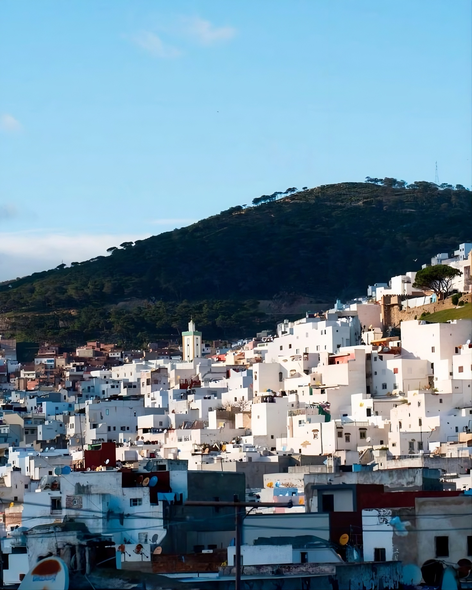

# analysis-data-electric-power-consumption

Aku menganalisis data dari kaggle yaitu data konsumsi power listrik di kota Tetouan, Maroko pada tahun 2018.
Tetouan adalah kota bersejarah di utara Maroko yang dijuluki sebagai "Kota Putih" karena dominasi warna putih pada bangunan-bangunannya. 
Kota ini memiliki 4 musim yaitu:
Musim Panas (Juni – September): suhu udara rata-rata bisa mencapai 27°-30° celcius
Musim Gugur (Oktober – November): suhu udara rata-rata 20° celcius
Musim Dingin (Desember – Maret): suhu udara rata-rata berkisar 9°-16° celcius
Musim Semi (April – Mei): suhu uara rata-rata berkisar 15°-22° celcius

