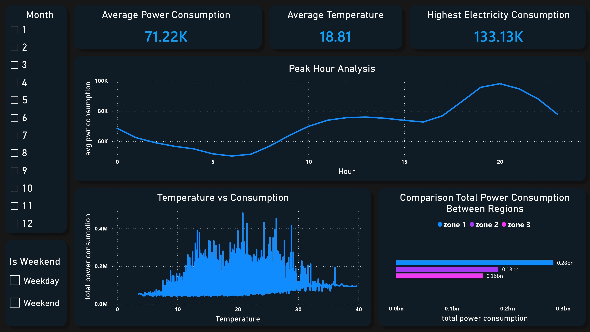

# data-analysis-electric-power-consumption  

Saya menganalisis data dari kaggle yaitu data konsumsi power listrik di kota Tetouan, Maroko pada tahun 2018. (https://www.kaggle.com/datasets/fedesoriano/electric-power-consumption)  

Tetouan merupaka kota bersejarah di utara Maroko yang dijuluki sebagai "Kota Putih" karena dominasi warna putih pada bangunan-bangunannya.  
  
Kota ini memiliki 4 musim:  
1. Musim Panas (Juni – September)&emsp;&emsp;&emsp;: suhu udara rata-rata bisa mencapai 27°-30° celcius  
2. Musim Gugur (Oktober – November)&emsp;: suhu udara rata-rata 20° celcius  
3. Musim Dingin (Desember – Maret)&emsp;&emsp;: suhu udara rata-rata berkisar 9°-16° celcius  
4. Musim Semi (April – Mei)&emsp;&emsp;&emsp;&emsp;&emsp;&emsp;: suhu uara rata-rata berkisar 15°-22° celcius  

<i>Kota Tetouan</i>
  

Data ini berisi pencatatan setiap 10 menit sekali sepanjang tahun 2018, dengan total 52.416 baris data.  
Saya menyederhanakan data ini menggunakan python dan pandas untuk melakukan beberapa proses:  
1. Resampling data dari per 10 menit menjadi rata-rata per jam (*hourly*).
2. Menghitung total penggunaan daya dari gabungan Zone 1, 2, dan 3. 
3. Serta menambah kolom pendukung seperti jam, nama hari, dan penanda *weekday/weekend*.

Data jadi jauh lebih ringkas (8.736 baris) dan siap untuk dianalisis.  
(code bisa di lihat di file **data_cleaning.ipynb**)  

Saya membuat sebuah dashboard di Power BI dari data yang telah disederhanakan  

  

Beberapa informasi dari dashboard:  
1. Puncak konsumsi power listrik per jam yaitu 133.33 kiloWatt  
2. Malam hari adalah jam puncak (peak hours) dalam penggunaan power listrik dan yang paling banyak adalah jam 8 malam  
3. Lonjakan pemakaian power listrik yang sangat aktif terjadi pada rentang suhu 12°C hingga 28°C. Ini menandakan bahwa warga warga di Tetouan sangat mengandalkan perangkat pendingin maupun pemanas ruangan saat terjadi perubahan suhu pergantian musim  
4. Zone 1 (wilayah stasiun Quads) memimpin jauh sebagai konsumen power listrik terbesar dengan total 0.28 BillionWatt  
5. Rata-rata konsumsi power listrik saat weekdays lebih besar daripada saat weekend  
  
  

